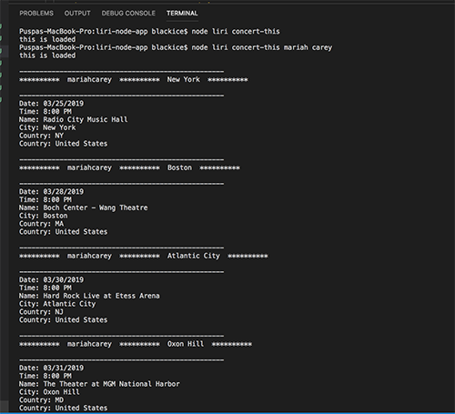

# liri-node-app
Creator: Puspa Sharma

Created on: March 22 2019

# ABOUT THE APP
LIRI is a Language Interpretation and Recognition Interface. LIRI is a command line node app that takes in parameters and gives back data. The user has the option of using four commands (listed below) in conjuntion with specific parameters associated with the commands. The Commands are:

concert-this

spotify-this-song

movie-this

do-what-it-says

# instructions
Open your terminal such as Bash.

Navigate to the folder that contains the liri.js file.

Depending on the command you run, the output will vary.

** ** Run the concert-this command

       1. node liri concert-this (artists name or band name) **

       2.node liri spotify-this-song

    
    
       3.node liri spotify-this-song (song)

      4 node liri movie-this (without movie name)

        node liri movie-this (with movie name)
