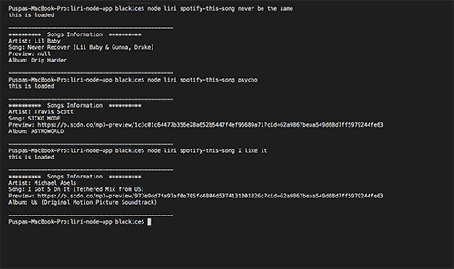
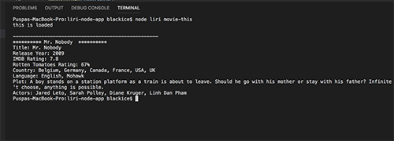
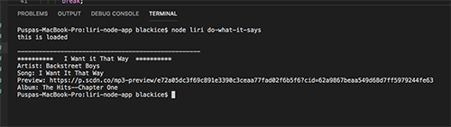

# LIRI-NODE-APP
Creator: Puspa Sharma

Created on: March 22 2019

# ABOUT THE APP
LIRI is a Language Interpretation and Recognition Interface. LIRI is a command line node app that takes in parameters and gives back data. The user has the option of using four commands (listed below) in conjuntion with specific parameters associated with the commands. The Commands are:

concert-this

spotify-this-song

movie-this

do-what-it-says

# INSTRUCTIONS
Open your terminal such as Bash.

Navigate to the folder that contains the liri.js file.

Depending on the command you run, the output will vary.

** ** command line instruction

        1. node liri concert-this (artists name or band name) **
        $ node liri concert-this mariah carey

        2.node liri spotify-this-song(with out any song)
        $node liri spotify-this-song

    
        3.node liri spotify-this-song (song)
        $ node liri spotify-this-song psycho

        4 node liri movie-this (without movie name)
        $ node liri movie-this

     
        5 node liri movie-this (with movie name)
        $ node liri movie-this roma

    
        6 node liri do-what-it-says
        $ node liri do-what-it-says
        Output: The system will read the text in the random.txt file, and perform the comman listed in the random.txt file.  

# TECHNOLOGIES USED
        Javascript
        Nodejs
        Node packages:
            Node-Spotify-API
            Request
            Moment
            DotEnv